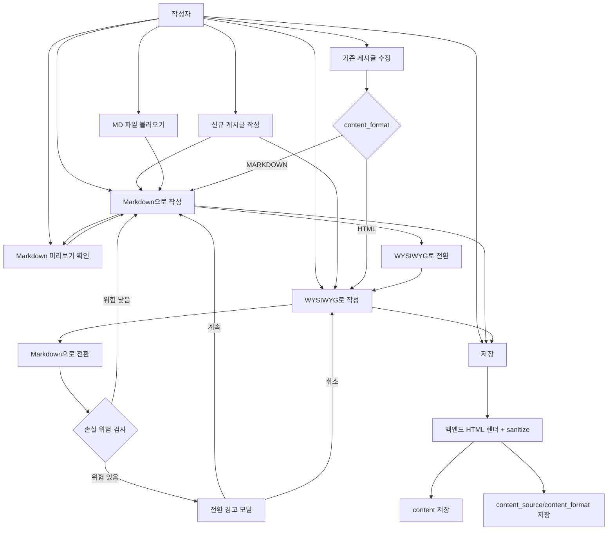
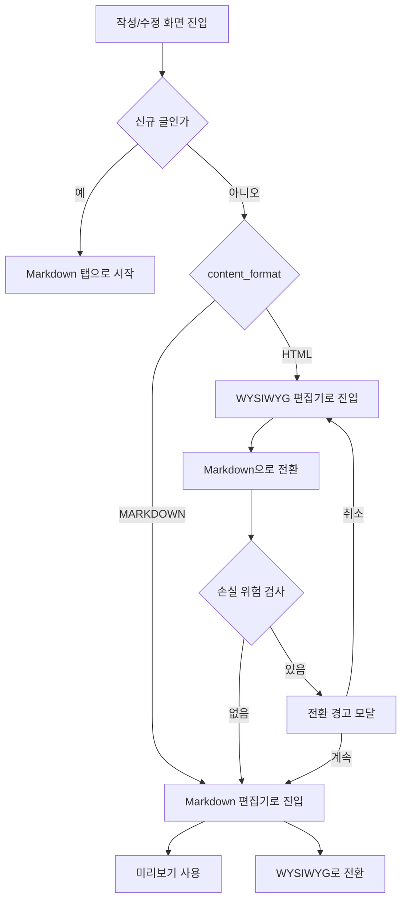
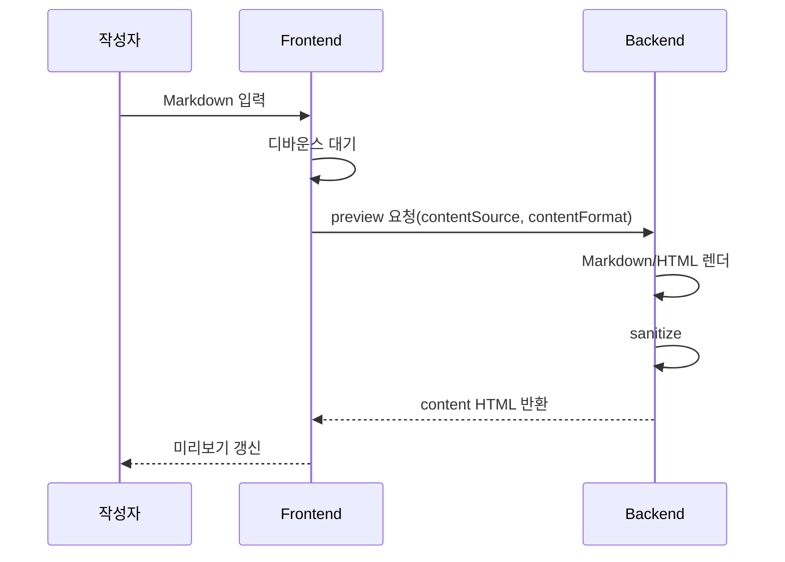
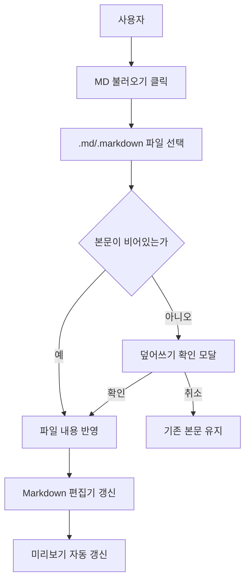

# Tiptap 작성 UX 재설계안

## 문서 목적
- 목적: 게시글 작성/수정 UX를 `Markdown 기본값 + WYSIWYG 동등 지원` 구조로 재설계하기 위한 기준안을 정리한다.
- 전제: 현재 게시글 본문 저장 기준은 HTML이고, 작성 화면은 `WYSIWYG + HTML` 구조다.
- 방향: 신규 작성 기본값은 `Markdown`으로 두되, 사용자는 언제든 `WYSIWYG`로 전환해 같은 화면 안에서 작성할 수 있어야 한다.

## 핵심 결론
- 신규 작성 기본 모드는 `Markdown`이다.
- `WYSIWYG`는 제거 대상이 아니라 `Markdown`과 양립하는 주 작성 모드다.
- 작성과 수정은 같은 모드 체계를 가져야 한다.
- `tb_articles.content`는 계속 `조회/렌더용 sanitized HTML`로 유지한다.
- `tb_articles`에는 `content_source`, `content_format` 컬럼을 추가해 작성 원본을 보존한다.
- `content_format = MARKDOWN`이면 수정 시 Markdown으로, `content_format = HTML`이면 수정 시 WYSIWYG로 진입한다.
- `Markdown 미리보기`는 필수 UX다.
- `MD 파일 임포트`는 Markdown 기본 작성 흐름과 잘 맞기 때문에 같이 넣는 것이 좋다.

## 현재 구현 기준 보정
- 상위 작성 모드는 현재 `Markdown`과 `WYSIWYG` 두 가지다.
- `Markdown` 모드 안에서 `작성 | 분할 | 미리보기`를 제공한다.
- `HTML 소스`는 상위 탭이 아니라 WYSIWYG 편집기 내부 `에디터 | HTML` 전환으로 제공한다.
- 신규 작성은 `MARKDOWN` 기본값으로 시작하고, 수정 화면은 저장된 `content_format` 기준으로 복원한다.
- MD 파일 임포트는 현재 `title`, `visibility`, `boardSlug`, `categoryName`을 읽어 반영한다.
- `tags`, `summary`, 미지원 frontmatter 키는 폼 UI에 자동 반영하지 않고 `content_source` 원문에 보존한다.
- `boardSlug` 자동 반영은 생성 화면에서만 허용하고, 수정 화면에서는 현재 게시판과 다르면 경고 후 무시한다.

## 제품 방향 요약

### 목표 UX
- 기본 시작은 Markdown
- 사용자가 원하면 즉시 WYSIWYG로 전환 가능
- 어떤 모드로 저장했는지에 따라 다음 수정 시 같은 경험으로 다시 열림

### 비목표
- `Markdown 중심`을 이유로 WYSIWYG를 밀어내는 것
- 기존 HTML 글을 강제로 Markdown으로 바꾸는 것
- 공개 조회 화면에서 프론트가 포맷별로 따로 렌더링하는 것

## 작성자 유스케이스 다이어그램



## 내가 상정한 화면 구조

- 아래 화면 구조는 방향 설명용 개념도다.
- 현재 구현은 `Markdown | WYSIWYG`를 상위 모드로 두고, `HTML 소스`는 WYSIWYG 내부 모드로 제공한다.

### 데스크톱 기본 화면
- 상단 모드
  - `Markdown`
  - `WYSIWYG`
  - `미리보기`
  - `HTML 소스`(선택)
- 기본값
  - 신규 작성: `Markdown`
  - 기존 수정: `content_format` 기준

```text
+------------------------------------------------------------------+
| 제목 입력                                                        |
+------------------------------------------------------------------+
| Markdown | WYSIWYG | 미리보기 | HTML 소스 | MD 불러오기 | 저장   |
+----------------------------------+-------------------------------+
|                                  |                               |
| 현재 편집 영역                   | 미리보기 또는 보조 패널       |
|                                  |                               |
| Markdown 탭: 마크다운 입력       | Markdown 선택 시 미리보기      |
| WYSIWYG 탭: 리치 에디터          | WYSIWYG 선택 시 선택형 패널    |
|                                  |                               |
+----------------------------------+-------------------------------+
```

### 모바일 기본 화면
- 상단 탭
  - `Markdown`
  - `WYSIWYG`
  - `미리보기`
  - `HTML 소스`(선택)
- 기본값
  - 신규 작성: `Markdown`

```text
+-------------------------------------------+
| 제목 입력                                 |
+-------------------------------------------+
| Markdown | WYSIWYG | 미리보기 | 저장      |
+-------------------------------------------+
|                                           |
| 현재 탭 내용                              |
| - Markdown: 마크다운 입력                 |
| - WYSIWYG: 리치 에디터                    |
| - 미리보기: 렌더 결과                     |
|                                           |
+-------------------------------------------+
```

## 왜 이렇게 가야 하나
- 블로그형 글쓰기는 Markdown이 강하다.
- 하지만 모든 사용자가 Markdown을 선호하는 것은 아니다.
- 리치 편집이 익숙한 사용자도 같은 화면에서 계속 작성할 수 있어야 한다.
- 따라서 핵심은 `Markdown only`가 아니라 `Markdown default + WYSIWYG coexistence`다.

## 데이터 저장 구조

### 대상 테이블
- 대상: `tb_articles`

### 컬럼 정책
- 유지 컬럼
  - `content`
- 추가 컬럼
  - `content_source`
  - `content_format`

### 각 컬럼의 성격
- `content`
  - 최종 조회/렌더용 HTML
  - sanitize를 통과한 안전한 본문
  - 기존 의미 유지
- `content_source`
  - 사용자가 실제 작성한 원본
  - Markdown으로 썼으면 Markdown 원문
  - WYSIWYG로 썼으면 HTML 원문
- `content_format`
  - `MARKDOWN`
  - `HTML`

### 왜 이 구조가 필요한가
- 신규 작성은 Markdown 기본이어도 WYSIWYG 사용자를 그대로 수용할 수 있다.
- 수정 시 작성 원본 포맷 그대로 다시 열 수 있다.
- Markdown 글은 Markdown으로, WYSIWYG 글은 WYSIWYG로 복원할 수 있다.

## `content` 컬럼의 성격은 바뀌는가
- 바뀌지 않는다.
- `content`는 계속 `HTML 태그 + 텍스트를 포함한 최종 본문 HTML` 컬럼이다.
- 즉 `content`를 Markdown 저장 컬럼으로 바꾸지 않는다.
- 공개 조회, 검색, 목록 노출은 기존처럼 `content` HTML 중심으로 간다.

## 저장 및 렌더링 정책

### 저장 시
1. 프론트가 `contentSource`, `contentFormat` 전송
2. 백엔드가 포맷에 따라 HTML 생성
3. 생성된 HTML을 sanitizer 통과
4. `content`에 저장
5. 원본은 `content_source`, `content_format`에 저장

### 공개 조회 시
- 프론트는 항상 `content`만 렌더링한다.
- `content_format`에 따라 프론트가 직접 Markdown을 렌더링하지 않는다.

### 이유
- 렌더링 규칙을 백엔드 기준으로 통일할 수 있다.
- sanitize 기준을 한 곳에 모을 수 있다.
- 미리보기, 저장 결과, 상세 화면 차이를 줄일 수 있다.

## 작성/수정 진입 정책

### 신규 작성
- 기본값: `Markdown`
- 사용자는 즉시 `WYSIWYG` 탭으로 이동 가능

### 기존 글 수정
- `content_format` 기준으로 진입
- `MARKDOWN`
  - Markdown 편집기로 진입
- `HTML`
  - WYSIWYG 편집기로 진입

### 결과
- 작성과 수정이 같은 규칙으로 동작한다.
- 사용자는 다음 수정 때도 자신이 쓰던 방식으로 이어서 작업할 수 있다.

## 작성/수정 진입 흐름



## Markdown 미리보기는 필요한가
- 결론: 반드시 필요하다.

### 이유
- Markdown은 원문이 곧 최종 화면이 아니다.
- 표, 코드블록, 체크리스트, 이미지, 인용, HTML fallback은 결과 화면 확인이 필요하다.
- 신규 작성 기본값이 Markdown이라면 미리보기는 핵심 UX다.

### 권장 원칙
- 데스크톱
  - `Markdown` 탭에서 분할 보기 또는 미리보기 토글 지원
- 모바일
  - `Markdown`과 `미리보기` 탭 전환
- WYSIWYG 모드
  - 본문 자체가 실시간 결과에 가까우므로 미리보기는 선택형

## 미리보기 UX 제안

### 원칙
- 미리보기는 저장 결과와 동일하거나 매우 가까워야 한다.
- 프론트 임의 렌더보다 서버 기준 렌더가 우선이다.

### 권장 방식
- `preview API` 사용

### API 예시
- `POST /api/articles/preview`

### 요청 예시
```json
{
  "contentSource": "# 제목\n\n본문",
  "contentFormat": "MARKDOWN"
}
```

### 응답 예시
```json
{
  "content": "<h1>제목</h1><p>본문</p>"
}
```

### 장점
- 저장 시점과 같은 렌더링 규칙 사용 가능
- sanitize 결과까지 미리 확인 가능
- 프론트 미리보기와 실제 상세 화면 차이를 줄일 수 있다

### 추가 UX
- 입력 후 300~500ms 정도 디바운스 미리보기
- 미리보기 실패 시 오류 배너
- 마지막 성공 렌더 유지

## 미리보기 동작 흐름



## 모드별 UX 정책

### Markdown 모드
- 목적: 기본 작성 경험
- 강점: 텍스트 중심 글쓰기, 코드블록, 문서 흐름
- 필요 요소
  - 미리보기
  - MD 불러오기
  - 간단 문법 툴바

### WYSIWYG 모드
- 목적: 리치 편집 선호 사용자를 위한 동등한 작성 경험
- 강점: 직관적 편집, 이미지/리치 블록 조작
- 역할
  - Markdown과 경쟁하는 대체 수단이 아니라 같은 작성 화면의 또 다른 주 모드

### HTML 소스 모드
- 목적: 고급 사용자용 직접 소스 편집
- 정책: 선택 기능
- 비고: 꼭 필요하지 않다면 나중 단계로 미뤄도 된다

## 모드별 툴바 정책

### Markdown 모드
- 유지 권장 항목
  - 제목
  - 굵게
  - 기울임
  - 링크
  - 이미지
  - 리스트
  - 체크리스트
  - 인용
  - 코드블록
  - 표
  - 미리보기 토글
  - MD 불러오기

### WYSIWYG 모드
- 현재 리치 툴바를 유지하되, 과한 복잡성은 정리 가능
- 이미지, 링크, 리스트, 표, 코드블록 등 핵심 블록 유지

### HTML 소스 모드
- 최소화
  - HTML 적용
  - 미리보기
  - Markdown으로 변환

## 모드 전환 UX

### 기본 원칙
- 전환 자체는 자유롭게
- 손실 가능성이 있을 때만 경고

### 경고가 필요한 경우
- `WYSIWYG -> Markdown`
- `HTML 소스 -> Markdown`
- `Markdown -> WYSIWYG` 중 HTML fallback이 많은 경우

### 경고 이유
- 전환은 단순 보기 변경이 아니라 저장 원본 포맷이 바뀔 수 있는 동작이다.
- 변환 후 다음 저장부터 `content_source`, `content_format`이 바뀔 수 있다.

### 권장 문구
- `현재 본문에는 Markdown에서 완전히 표현되지 않는 요소가 있습니다. 일부는 HTML 블록으로 보존되거나 편집 손실이 생길 수 있습니다.`

## Markdown 지원 범위

| 기능 | Markdown 직접 표현 | 정책 |
| --- | --- | --- |
| 제목 | 가능 | 기본 지원 |
| 굵게/기울임/취소선 | 가능 | 기본 지원 |
| 링크 | 가능 | 기본 지원 |
| 이미지 | 가능 | 기본 지원 |
| 체크리스트 | 가능 | 기본 지원 |
| 코드블록 | 가능 | 기본 지원 |
| 표 | 가능 | 기본 지원 |
| 인용 | 가능 | 기본 지원 |
| 밑줄 | 제한적 | HTML fallback 또는 손실 안내 |
| 글자색/폰트/크기 | 어려움 | Markdown 모드 비지원 |
| 정렬 | 어려움 | HTML fallback |
| 이미지 캡션 | 어려움 | HTML fallback |
| 이미지 정렬/배율 | 어려움 | HTML fallback |
| 유튜브 | 제한적 가능 | velog식 커스텀 문법 지원 |
| 비디오 | 어려움 | HTML `video` fallback |
| 멘션 | 정책 필요 | 텍스트 치환 또는 HTML fallback |

## Markdown 유튜브 임베드 정책

### 방향
- Markdown에서는 `velog`식 커스텀 문법으로 유튜브를 입력한다.
- 최종 저장/렌더 시에는 기존 WYSIWYG/HTML이 사용하는 유튜브 embed HTML 구조로 정규화한다.

### 권장 입력 문법
- `!youtube[dQw4w9WgXcQ]`
- `!youtube[https://youtu.be/dQw4w9WgXcQ]`
- `!youtube[https://www.youtube.com/watch?v=dQw4w9WgXcQ]`

### 처리 정책
- Markdown 파서 단계에서 `!youtube[...]`를 감지한다.
- 내부적으로 유튜브 video id를 추출한다.
- 추출 성공 시 기존 유튜브 embed HTML 블록으로 변환한다.
- 추출 실패 시 실행 차단 대신 원문을 그대로 보존하고 경고를 표시한다.

### 허용 범위
- `youtube.com`
- `www.youtube.com`
- `youtu.be`
- 필요 시 `youtube-nocookie.com`

### 제외 범위
- 일반 `iframe` 직접 입력
- 임의 외부 동영상 사이트
- 자동 업로드 대상 처리

### 이유
- WYSIWYG/HTML과 최종 렌더 구조를 통일할 수 있다.
- 표준 Markdown 바깥 기능이지만 작성 UX는 단순하게 유지할 수 있다.
- sanitizer와 allowlist 정책을 좁게 유지할 수 있다.

## 변환 정책

### Markdown -> HTML
- Markdown 파서로 HTML 생성
- 생성된 HTML을 sanitizer 통과

### WYSIWYG/HTML -> Markdown
- 지원 가능한 요소는 Markdown으로 직렬화
- 어려운 요소는 HTML 블록으로 남긴다

### HTML fallback 예시
```html
<figure data-type="editor-image" data-align="center" data-original-width="1280" data-original-height="720">
  
  <figcaption>샘플 캡션</figcaption>
</figure>
```

## Markdown 파일 임포트 UX

### 목적
- 사용자가 로컬 `*.md`, `*.markdown` 파일을 바로 불러와 초안을 빠르게 만들 수 있어야 한다.

### 권장 위치
- Markdown 툴바
- 상단 액션 영역

### 기본 동작
1. 사용자가 `.md` 파일 선택
2. 파일 내용을 Markdown 편집기에 반영
3. 본문이 이미 있으면 덮어쓰기 확인 모달 노출

### 추가 권장 사항
- UTF-8 BOM 제거
- 큰 파일 로딩 표시
- frontmatter 지원
  - `title`, `visibility`, `categoryName` 자동 반영
  - 생성 화면에서는 `boardSlug`가 현재 게시판과 다르면 라우트를 조정
  - `tags`, `summary`, 미지원 키는 `content_source` 원문에 보존

## MD 파일 임포트 흐름



## 레거시 HTML 글 처리 정책

### 권장안
- 기존 HTML 글은 그대로 `HTML` 포맷으로 유지
- 수정 시 기본 진입은 WYSIWYG
- 사용자가 명시적으로 `Markdown으로 변환`을 눌렀을 때만 전환

### 이유
- 강제 자동 변환은 손실 가능성이 크다.
- Markdown 기본 작성 UX와 기존 HTML 글 안정성을 동시에 가져갈 수 있다.

## Flyway 방향

### 목표
- `tb_articles`에 작성 원본 컬럼을 추가
- 기존 `content`는 유지

### 실제 적용 파일
- [V13__article_content_source_and_format.sql](/D:/MyProject/mocktalk-workspace/mocktalkback/src/main/resources/db/migration/V13__article_content_source_and_format.sql)

### 현재 의미
- 현재 운영 코드에 반영된 실제 마이그레이션 파일이다.
- 기존 `content`를 `content_source`로 백필하고 `content_format` 기본값을 `MARKDOWN`으로 설정한다.

## 단계별 도입 및 현재 상태

- 현재 기준으로 `1단계` 항목은 구현 완료됐다.
- `2단계`는 변환 품질 개선과 미리보기 성능 튜닝 같은 후속 품질 개선 과제다.
- `3단계`는 HTML 소스 UX 세부화, 자동 저장, 모바일 고도화 같은 확장 영역으로 남아 있다.

### 1단계
- `tb_articles.content_source`, `tb_articles.content_format` 추가
- 신규 작성 기본값을 `Markdown`으로 전환
- 같은 화면 안에 `Markdown`과 `WYSIWYG` 탭 공존
- Markdown 미리보기 추가
- `preview API` 추가
- `MD 파일 임포트` 추가

### 2단계
- WYSIWYG -> Markdown 변환 품질 개선
- HTML fallback 정책 정교화
- 미리보기 성능 튜닝

### 3단계
- HTML 소스 모드 필요성 재평가
- 자동 저장
- 코드블록 UX 강화
- 모바일 작성 UX 고도화

## 한 줄 권고
- 이 설계의 핵심은 `Markdown을 기본값으로 두되, WYSIWYG를 같은 급의 작성 모드로 함께 제공하고, 저장된 원본 포맷대로 수정 경험을 복원하는 것`이다.
